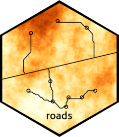

<!-- README.md is generated from README.Rmd. Please edit that file -->

```{r, include = FALSE}
knitr::opts_chunk$set(
  collapse = TRUE,
  comment = "#>",
  fig.path = "man/figures/README-",
  out.width = "100%"
)
```

# roads <a href="https://landscitech.github.io/roads/"></a>


<!-- badges: start -->

[](https://CRAN.R-project.org/package=roads)
[](https://github.com/LandSciTech/roads/actions/workflows/R-CMD-check.yaml)
<!-- badges: end -->

The goal of roads is to simulate road development under resource
development scenarios. 

## Installation

You can install the released version of roads from
[CRAN](https://CRAN.R-project.org) with:

``` r
install.packages("roads")
```

And the development version from
[GitHub](https://github.com/LandSciTech/roads) with:

``` r
# install.packages("devtools")
devtools::install_github("LandSciTech/roads")
```

## Example

To simulate the development of roads three inputs are needed: the
current road network (roads), the locations that should be connected to
the road network (landings) and the cost of building roads across the
landscape (cost). Typically the roads and landings are `sf` objects or `sp`
Spatial\* objects and the cost is a raster.

```{r example, message=FALSE}
library(roads)
library(raster)

# data set installed with roads package
demoScen <- prepExData(demoScen)
scen <- demoScen[[1]]

prRoads <- projectRoads(landings = scen$landings.points, 
                        cost = scen$cost.rast,
                        roads = scen$road.line, 
                        plotRoads = TRUE) 

```

By default `projectRoads` uses an iterative least cost paths algorithm (`roadMethod = "ilcp"`) to connect each landing to the existing road by the lowest cost path, updating the cost after each landing is connected. Other methods available are: minimum spanning tree with least cost
paths (`roadMethod = "mst"`) to connect all landings to the
nearest existing road or other landing following the path with the
lowest cost across all landings, least cost path
(`roadMethod = "lcp"`) which connects each landing to the nearest road
via the least cost path but independent of other landings and snapping
(`roadMethod = "snap"`) which ignores both cost and other landings and
simply connects each landing to the nearest road "as the crow flies".

For more details on how to use the package see the vignette `vignette("roads-vignette", package = "roads")`

# License

Copyright (C) 2021 Her Majesty the Queen in Right of Canada, as
represented by the Minister of Environment and Climate Change.

And 

Copyright 2018 Province of British Columbia

Licensed under the Apache License, Version 2.0 (the "License"); you may
not use this file except in compliance with the License. You may obtain
a copy of the License at

<https://www.apache.org/licenses/LICENSE-2.0>

Unless required by applicable law or agreed to in writing, software
distributed under the License is distributed on an "AS IS" BASIS,
WITHOUT WARRANTIES OR CONDITIONS OF ANY KIND, either express or implied.
See the License for the specific language governing permissions and
limitations under the License.
