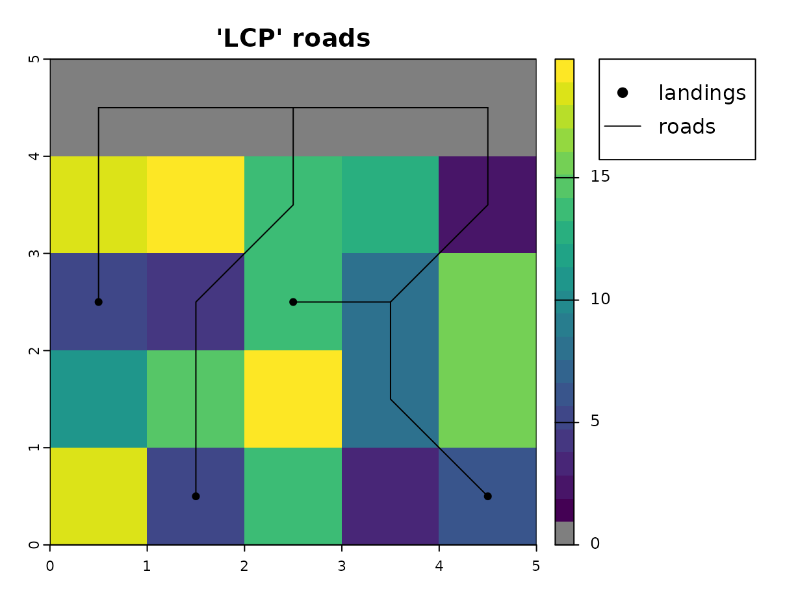
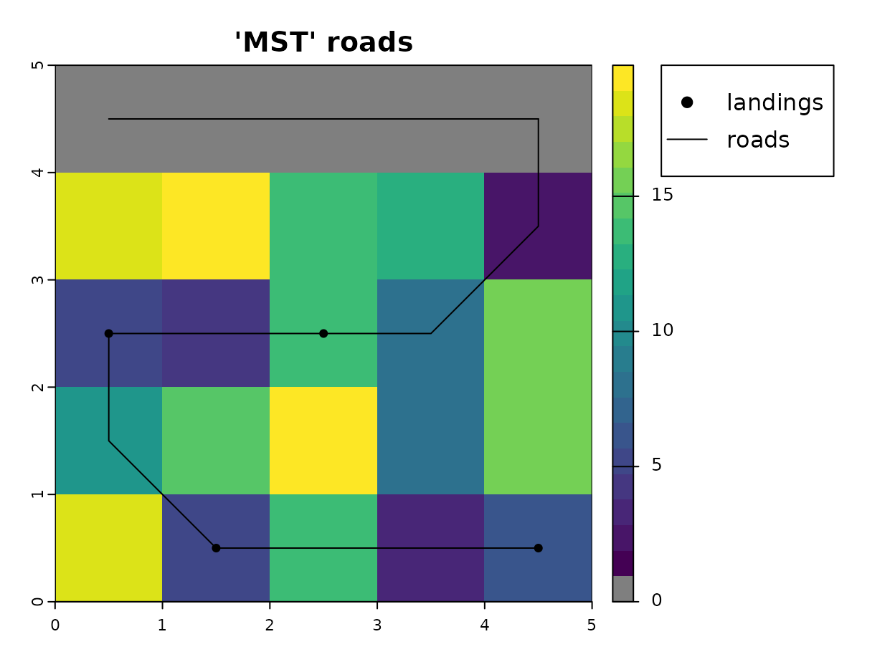
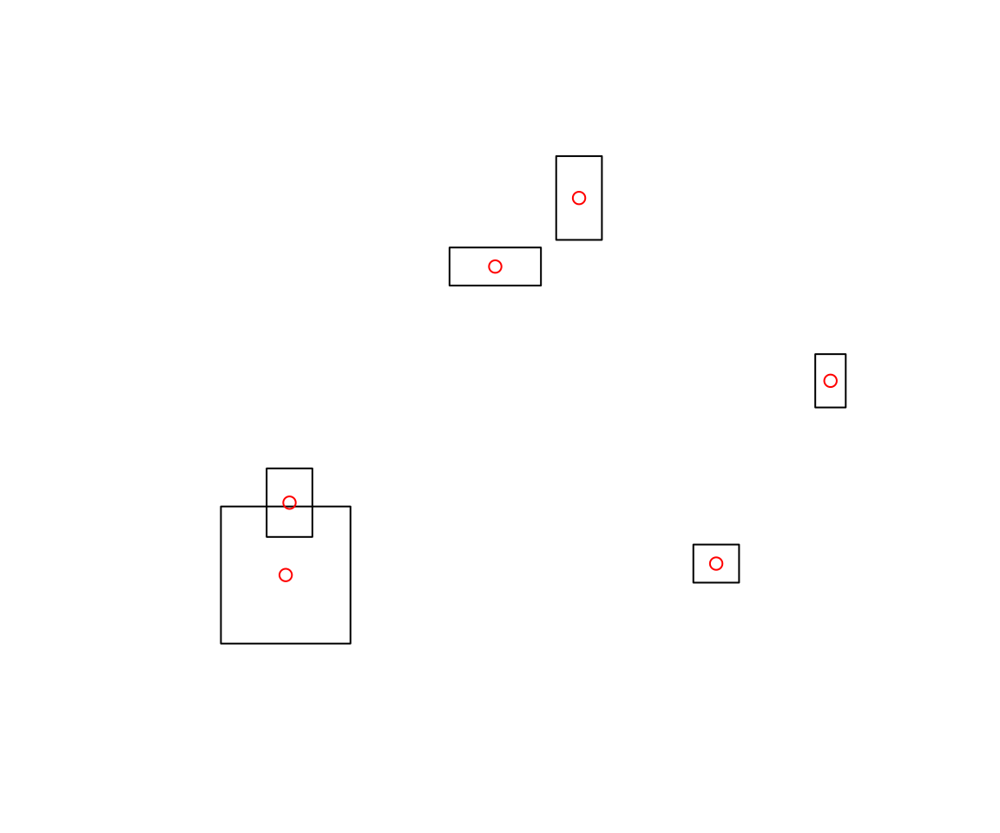
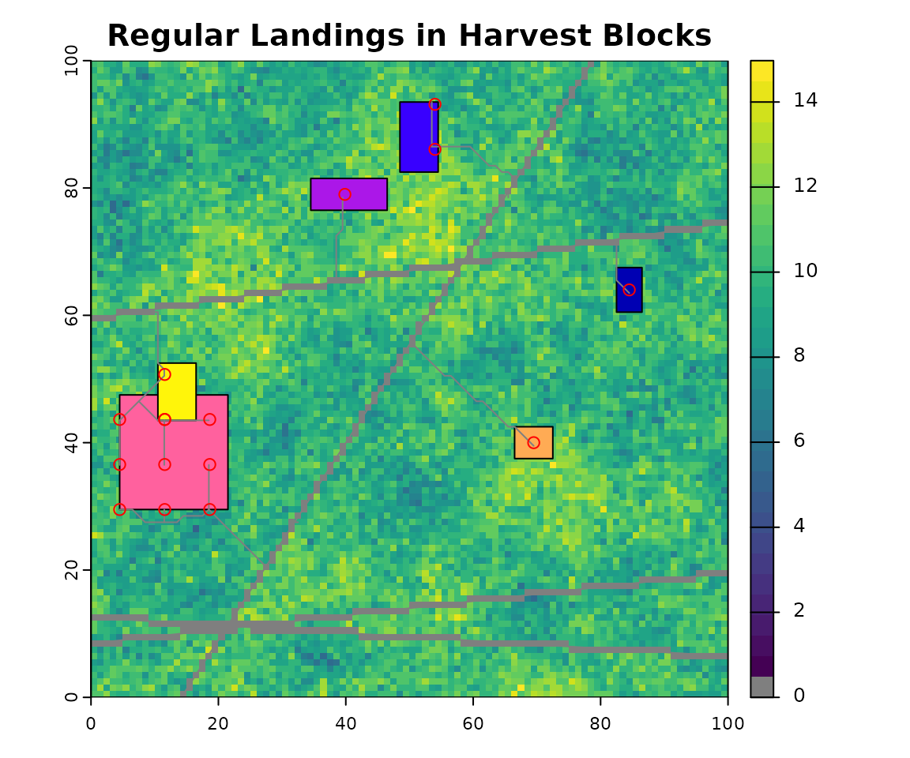

# roads Package

## Introduction

This tutorial on using the `projectRoads` function of the `roads`
package to project forest road networks borrows heavily from a
demonstration written by Kyle Lochhead and Tyler Muhly in 2018. Example
data sets used below are included in the package as `CLUSexample` and
`demoScen`.

There are three main inputs to the `projectRoads` function:

1.  **weightRaster and weightFunction:** together, these determine the
    cost to build a road between two adjacent raster cells. The
    `weightRaster` is a spatial gridded raster with values for all
    locations where road construction is possible. The `weightFunction`
    calculates the cost of constructing a road between two adjacent
    raster cells from the `weightRaster` at each of those cells.
2.  **Existing Road Network:** a spatial representation of the existing
    road network.
3.  **Landings:** a set of locations to be connected to the existing
    road network by constructing new roads.

`projectRoads` simulates new roads that connect landings to the existing
road network using one of four methods:

1.  **Snap**
2.  **Least-cost path (LCP)**
3.  **Iterative least-cost path (ILCP)**
4.  **Minimum spanning tree (MST)**

The output of `projectRoads` is a list of simulation results referred to
as a “sim list”. The list contains five elements:

1.  **roads:** the projected road network, including new and input
    roads.
2.  **weightRaster:** the updated `weightRaster` in which new and old
    roads have value 0.
3.  **roadMethod** the road simulation method used.
4.  **landings** the landings used in the simulation.
5.  **g** the graph that describes the cost of paths between each cell
    in the updated `weightRaster`. Edges between vertices connected by
    new roads have weight 0. `g` can be used to avoid the cost of
    rebuilding the graph in a simulation with multiple time steps.

#### Setup

``` r
library(terra)
library(dplyr)
library(sf)
library(roads)

## colours for displaying weight raster 
if(requireNamespace("viridis", quietly = TRUE)){
  # Use colour blind friendly palette if available
  rastColours <- c('grey50', viridis::viridis(20))
} else {
  rastColours <- c('grey50', terrain.colors(20))
}

# terra objects need to be wrapped to be saved, this unwraps them
CLUSexample <- prepExData(CLUSexample)
```

## Resource development scenario

#### 1. Weights Raster and Weight Function

The cost of constructing a road segment to connect adjacent cells is
determined by the `weightFunction` and the `weightRaster`. The
`weightFunction` calculates the cost of construction between adjacent
cells from the value of the `weightRaster` at those cells and the
distance between them. Two methods of calculating costs are provided,
and there is an option for users to develop their own. The default
`weightFunction = simpleCostFn` assumes that the values in the
`weightRaster` represent the cost of building a road across a cell, and
sets cost as the mean value of adjacent cells. The alternative
`weightFunction = gradePenaltyFn` penalizes road construction on steep
grades by setting cost as a function of the difference in `weightRaster`
values between adjacent cells. In this case, the `weightRaster` is an
elevation raster that can also include barriers. See
[`?gradePenaltyFn`](https://landscitech.github.io/roads/reference/gradePenaltyFn.md)
for details.

The following points apply to all `weightRasters`:

- The `weightRaster` must be a single, numeric `SpatRaster` or
  `RasterLayer` object.
- The coordinate reference system (CRS) of this raster must match the
  CRS of the existing road network and landings.  
- The `weightRaster` determines the extent of area considered for new
  road construction. Existing roads and landings outside the extent of
  the `weightRaster` are ignored.
- Values of cells that include existing roads should be 0, and all 0
  values are assumed to be existing roads. Existing roads can be added
  to `weightRaster` by setting `roadsInWeight = FALSE`.
- The resolution of the `weightRaster` determines the resolution of the
  constructed road network. Adjacent cells are connected with straight
  road segments, and each cell either contains a road, or it does not.
- NA values in the `weightRaster` are not included in the graph, and are
  not considered for road construction. A landing surrounded by NAs that
  cannot be connected to the existing road network will produce an
  error.

The weight raster for this basic example is a cost surface and the
`weightFunction` used is the average.

``` r
weightRaster <- CLUSexample$cost
```

#### 2. Existing road network layer

The network of existing roads must be provided as an `sf` object with
geometry type `"LINES"`, a `SpatialLines` object, a `RasterLayer`, or a
`SpatRaster`. If the input roads are a raster the projected roads will
also be returned as a raster by default, but if `roadsOut = "sf"` then a
geometry collection of lines and points will be returned with points
representing the input roads.

The road network included in the `CLUSexample` data-set is a raster but
we use a line for plotting.

``` r
## existing roads network
roadsLine <- sf::st_sfc(geometry = sf::st_linestring(
  matrix(c(0.5, 4.5, 4.5, 4.5),
         ncol = 2, byrow = T) 
)) %>%
  sf::st_as_sf(crs = sf::st_crs(weightRaster))
```

#### 3. Landings layer(s)

Landings, or resource development locations, that are to be connected to
the existing road network can be specified in a variety of forms:

- A `sf` object with geometry type `"POINTS"` or `"POLYGON"`
- A logical `SpatRaster` or `RasterLayer` object with cell values of
  `TRUE` for landings,
- A `SpatialPoints` or `SpatialPointsDataFrame` object with points
  representing landings,
- A matrix with at least two columns, with columns 1 and 2 representing
  x any y coordinates of landing locations respectively,
- A `SpatialPolygons`or `SpatialPolygonsDataFrame` object with polygons
  representing landings,

If the landings are polygons then the centroid is used as the
destination for new roads. For more control or to specify more than one
landing per polygon see Multiple landings per harvest section below.

``` r
## landings as spatial points
landings <- roads::CLUSexample$landings

## plot example scenario
par(omi = c(0,0,0,1.2))
plot(weightRaster, col = rastColours, main = 'Example Scenario')
plot(roadsLine, add = TRUE)
plot(landings, add = TRUE, pch = 19)
legend(x = 7.25, y = 5, legend = c("landings", "roads"), pch = c(19, NA), 
       lwd = c(NA, 1),
       xpd = NA, inset = -0.1, xjust = 1)
```


Notice that the top row of the raster has a cost of zero where an
existing road traverses the landscape.

#### Output format

`projectRoads` accepts a wide range of classes of spatial objects as
input but all results are returned as `sf` for vectors and `SpatRaster`
for rasters.

## Simulation of new roads development

### Simulation methods

#### 1. Snapping

This approach simply ‘snaps’ a landing to the nearest (by Euclidean
distance) existing road segment, ignoring spatial variation in road
construction cost and the locations of other landings and access roads.

``` r
## project new roads using the 'snap' approach
projRoads_snap <- roads::projectRoads(landings, weightRaster, roadsLine,
                                      roadMethod = 'snap')
#> 0s detected in weightRaster raster, these will be considered as existing roads

par(omi = c(0,0,0,1.2))
## plot the weight raster, landings, and roads segments to the landings
plot(weightRaster, col = rastColours, main = "'Snapped' roads")
points(landings, pch = 19)  
plot(projRoads_snap$roads, add = TRUE) 

## update legend
legend(x = 7.25, y = 5, legend = c("landings", "roads"), pch = c(19, NA), 
       lwd = c(NA, 1),
       xpd = NA, inset = -0.1, xjust = 1)
```


This simple approach gives an unrealistically redundant road network
without branches that does not account for variation in road
construction costs across the landscape.

#### 2. Least Cost Paths (LCP)

The least cost paths method builds a ‘cost directed’ path (i.e., “as the
wolf runs”) for each landing to the existing road network. A
mathematical [graph](https://en.wikipedia.org/wiki/Graph_theory) with a
node for each non-NA cell in the `weightRaster` and edge weights
determined by the `weightFunction` is built using
[`igraph`](https://igraph.org/r/). The graph is used to compute least
cost paths between each landing and the nearest existing road using
[Dijkstra’s
algorithm](https://en.wikipedia.org/wiki/Dijkstra%27s_algorithm)
implemented in the
[shortest_paths](https://igraph.org/r/doc/distances.html) function in
`igraph`. Graph weights are updated to include new roads after all new
roads are identified.

``` r
## project new roads using the 'LCP' approach
projRoads_lcp <- roads::projectRoads(landings, 
                                        weightRaster, 
                                        roadsLine, 
                                        roadMethod = 'lcp')
#> 0s detected in weightRaster raster, these will be considered as existing roads

par(omi = c(0,0,0,1.2))
## plot the weight raster and overlay it with new roads
plot(weightRaster, col = rastColours, main = "'LCP' roads")
plot(projRoads_lcp$roads, add = TRUE)
points(landings, pch = 19) 
## legend
legend(x = 7.25, y = 5, legend = c("landings", "roads"), pch = c(19, NA), 
       lwd = c(NA, 1),
       xpd = NA, inset = -0.1, xjust = 1)
```



The main disadvantage of this approach is that roads are developed
independently, which tends to produce parallel or redundant roads. This
could mimic road development in cases where licensees restrict others
from using their road (i.e., gated roads), and thereby force others to
consider building a nearly parallel road. In some cases there will be
branching, where two roads connecting two landings to an existing road
network will use the same least cost path; however, this will be
conditional on the spatial configuration of the local cost surface and
the existing road network.

#### 3. Iterative Least Cost Paths (ILCP)

This approach builds fewer redundant roads than the LCP method because
the graph edge weights are updated after each landing is accessed, so
that roads built earlier can be reused to access other landings. The
order is determined by the `ordering` argument to `projectRoads`; by
default the closest landings are accessed first. The alternative
`ordering = none` builds roads in the order that landings are supplied
by the user.

``` r
## project new roads using the 'ILCP' approach
projRoads_ilcp <- roads::projectRoads(landings, 
                                        weightRaster, 
                                        roadsLine, 
                                        roadMethod = 'ilcp')
#> 0s detected in weightRaster raster, these will be considered as existing roads

par(omi = c(0,0,0,1.2))
## plot the weight raster and overlay it with new roads
plot(weightRaster, col = rastColours, main = "'ILCP' roads")
plot(projRoads_ilcp$roads, add = TRUE)
points(landings, pch = 19)  ## landings points
## legend
legend(x = 7.25, y = 5, legend = c("landings", "roads"), pch = c(19, NA), 
       lwd = c(NA, 1),
       xpd = NA, inset = -0.1, xjust = 1)
```


The ILCP approach produces a more realistic branching network with less
redundancy. However, it is sensitive to the ordering of the landings.
Below we reverse the order of the landings but continue using the
default ordering of closest first. The two closest landings are tied for
distance to the road and the tie is broken by the order they are
supplied in so switching that produces a different road network.

``` r
## project new roads using the 'ILCP' approach
projRoads_ilcp2 <- roads::projectRoads(st_coordinates(landings)[4:1,], 
                                        weightRaster, 
                                        roadsLine, 
                                        roadMethod = 'ilcp')
#> 0s detected in weightRaster raster, these will be considered as existing roads
#> CRS of landings supplied as a matrix is assumed to match the weightRaster

par(omi = c(0,0,0,1.2))
## plot the weight raster and overlay it with new roads
plot(weightRaster, col = rastColours, main = "'ILCP' roads")
plot(projRoads_ilcp2$roads, add = TRUE)
points(landings, pch = 19)  ## landings points
## legend
legend(x = 7.25, y = 5, legend = c("landings", "roads"), pch = c(19, NA), 
       lwd = c(NA, 1),
       xpd = NA, inset = -0.1, xjust = 1)
```


#### 4. Minimum Spanning Tree (MST) with Least Cost Paths (LCP)

The MST approach builds upon the LCP approach by determining if landings
should be connected to one another before being connected to the
existing road network. In the MST approach, LCPs are estimated both
between the landings and between landings and the existing road network.
These distances are then used as nodes for solving a minimum spanning
tree network that minimizes the overall cost of connecting all landings
to the existing road network.

``` r
## project new roads using the 'MST' approach
projRoads_mst <- roads::projectRoads(landings, 
                                        weightRaster,
                                        roadsLine, 
                                        roadMethod = 'mst')
#> 0s detected in weightRaster raster, these will be considered as existing roads

par(omi = c(0,0,0,1.2))
## plot the weight raster and overlay it with new roads
plot(weightRaster, col = rastColours, main = "'MST' roads")
plot(projRoads_mst$roads, add = TRUE)
points(landings, pch = 19) 
## legend
legend(x = 7.25, y = 5, legend = c("landings", "roads"), pch = c(19, NA), 
       lwd = c(NA, 1),
       xpd = NA, inset = -0.1, xjust = 1)
```



The MST approach will produce fewer roads than the other approaches, and
realistic branching patterns. However, it is also more computationally
costly than the other methods.

### One-time versus multi-temporal simulation

Roads can be projected over a single time step (one-time) or over
multiple time steps. To demonstrate construction over multiple time
steps we use a demonstration scenario `demoScen` data-set included in
the roads package. The scenario includes four different sets of
landings.

``` r
## colours for displaying weight raster
if(requireNamespace("viridis", quietly = TRUE)){
  # Use colour blind friendly palette if available
  rastColours2 <- c('grey50', viridis::viridis(30))
} else {
  rastColours2 <- c('grey50', terrain.colors(30))
}

## scenario 
demoScen <- prepExData(demoScen)
scen <- demoScen[[1]]
## landing sets 1 to 4 of this scenario 
land.pnts <- scen$landings.points[scen$landings.points$set %in% c(1:4),]
## plot the weight raster and landings
par(mar=par('mar')/2)
plot(scen$cost.rast, col = rastColours2, main = 'Cost and landings (by set)')
plot(land.pnts %>% st_geometry(), add = TRUE, pch = 21, cex = 2, bg = 'white')
text(st_coordinates(land.pnts), labels = land.pnts$set, cex = 0.6, adj = c(0.5, 0.3),
     xpd = TRUE)
```


#### One-time simulation

If landings, costs, and roads are all specified to `projectRoads`, then
a one-time road simulation will be performed that returns a list object
holding the projected roads and related information. This can be
repeated multiple times for different road building scenarios but each
simulation will be independent of the others.

``` r
## project roads for landing sets 1 to 4, with independent one-time simulations
oneTime_sim <- list() ## empty list 
for (i in 1:4){
  oneTime_sim <- c(oneTime_sim,
                       roads::projectRoads(land.pnts[land.pnts$set==i,],
                                              scen$cost.rast,
                                              scen$cost.rast==0,
                                              roadMethod='mst')$roads)
}
#> 0s detected in weightRaster raster, these will be considered as existing roads
#> 0s detected in weightRaster raster, these will be considered as existing roads
#> 0s detected in weightRaster raster, these will be considered as existing roads
#> 0s detected in weightRaster raster, these will be considered as existing roads

## plot
oldpar <- par(mfrow = c(2, 2), mar = par('mar')/2)
for (i in 1:4){
  oneTime_sim[[i]][!oneTime_sim[[i]]] <- NA 
  plot(scen$cost.rast, col = rastColours2, 
       main = paste0('Landings set ', i),
       legend = FALSE)
  plot(oneTime_sim[[i]], add = TRUE, col = "grey50", legend = FALSE)
  plot(st_geometry(land.pnts[land.pnts$set == i, ]), add = TRUE,
       pch = 21, cex = 1.5, bg = 'white')
}
```


These independent one-time simulations are appropriate if each landing
set represents a different development scenario (e.g. each representing
a possible set of landings at time t=1), but they are not appropriate if
landings sets are sequential (e.g. set 1 is development at time t=1, set
2 is development at time t=2, and so on). In the latter case, roads at
the beginning of time t should be the union of roads developed in all
previous times steps.

``` r
## raster representing the union of completely independent simulations for multiple sets
oneTime_sim <- rast(oneTime_sim)
independent <- any(oneTime_sim, na.rm = TRUE)
## set non-road to NA for display purposes
independent[!independent] <- NA

## plot 
plot(scen$cost.rast, col = rastColours2,
     main = 'Union of independent sim results',
     legend = FALSE)

plot(independent, col = 'grey30', add = TRUE, legend = FALSE)

plot(st_geometry(land.pnts), add = TRUE, pch = 21, cex = 1.5, bg = 'white')
```


#### Multi-temporal simulation

Multi-temporal (multiple time steps) road projections can be obtained by
providing `projectRoads` with the list produced by a previous call to
`projectRoads`, and a new set of landings. The function uses the `sim`
list as a starting point, and avoids the computational cost of
reconstructing the landscape graph. This can be implemented in a loop.

``` r
## continuing on with demo scenario 1
## landing sets 1 to 4 of this scenario as a raster stack
land.stack <- scen$landings.stack[[1:4]]

# initialize sim list with first landings set
multiTime_sim <- list(projectRoads(land.stack[[1]], scen$cost.rast, 
                                               scen$road.line))
#> 0s detected in weightRaster raster, these will be considered as existing roads
#> harvest raster values are all in 0,1. Using patches as landing areas

# iterate over landings sets using the sim list from the previous run as input
for (i in 2:nlyr(land.stack)) {
  multiTime_sim <- c(
    multiTime_sim,
    list(projectRoads(sim =  multiTime_sim[[i-1]], landings = land.stack[[i]]))
  ) 
}
#> 0s detected in weightRaster raster, these will be considered as existing roads
#> harvest raster values are all in 0,1. Using patches as landing areas
#> 0s detected in weightRaster raster, these will be considered as existing roads
#> harvest raster values are all in 0,1. Using patches as landing areas
#> 0s detected in weightRaster raster, these will be considered as existing roads
#> harvest raster values are all in 0,1. Using patches as landing areas

par(mfrow = c(3, 2))
par(mar = par('mar')/2)
  plot(scen$cost.rast, col = rastColours2, main = 'Roads at time t = 0', 
       legend = FALSE)
  plot(scen$road.line, col = 'grey30', add = TRUE, legend = FALSE)
  
for (i in 1:length(multiTime_sim)){
  plot(multiTime_sim[[i]]$weightRaster, col = rastColours2, 
       main = paste0('Roads at time t = ', i), legend = FALSE)
  plot(multiTime_sim[[i]]$roads, col = 'grey30', add = TRUE, legend = FALSE)
  plot(st_geometry(land.pnts[land.pnts$set == i, ]), add = TRUE, pch = 21, 
         cex = 1.5, bg = 'white')
  if (i >= 2){
    plot(st_geometry(land.pnts[land.pnts$set < i, ]), add = TRUE, pch = 1, cex = 1.5)
    plot(st_geometry(land.pnts[land.pnts$set == i, ]), add = TRUE, pch = 21, 
         cex = 1.5, bg = 'white')
  }
}
```


### Multiple landings per harvest block

Often harvest information is available as polygons showing the cutover
area but the point locations of landings are not known. The roads
package includes the `getLandingsFromTarget` function to address these
situations. By default `getLandingsFromTarget` will use the centroid of
a polygon as the landing but other `sampleType` options include
`"random"` or `"regular"` selection of multiple landing points within
harvest blocks. For `"random"` or `"regular"` sampling, `landingDens`
specifies the expected number of landings per unit area.

``` r
harvPoly <- demoScen[[1]]$landings.poly

outCent <- getLandingsFromTarget(harvPoly)
#> Warning: st_point_on_surface assumes attributes are constant over geometries
plot(sf::st_geometry(harvPoly))
plot(outCent, col = "red", add = TRUE)
```



``` r

# Get random sample with density 0.02 pts per unit area
outRand <- getLandingsFromTarget(harvPoly, 0.02, sampleType = "random")
#> you have asked for > 0.001 pts per m2 which is > 1000 pts per km2 and may take a long time
prRand <- projectRoads(outRand, scen$cost.rast, scen$road.line)
#> 0s detected in weightRaster raster, these will be considered as existing roads

plot(scen$cost.rast, main = "Random Landings in Harvest Blocks",
     col = rastColours2)
plot(harvPoly, add = TRUE)
plot(prRand$roads, add = TRUE,  col = "grey50")
plot(outRand, col = "red", add = TRUE)
```


``` r

# Get regular sample with density 0.02 pts per unit area
outReg <- getLandingsFromTarget(harvPoly, 0.02, sampleType = "regular")
#> you have asked for > 0.001 pts per m2 which is > 1000 pts per km2 and may take a long time
prReg <- projectRoads(outReg, scen$cost.rast,scen$road.line)
#> 0s detected in weightRaster raster, these will be considered as existing roads


plot(scen$cost.rast, main = "Regular Landings in Harvest Blocks",
     col = rastColours2)
plot(harvPoly, add = TRUE)
plot(prReg$roads, add = TRUE, col = "grey50")
plot(outReg, col = "red", add = TRUE)
```



``` r


# clean up 
par(oldpar)
```

## Note

This vignette is partially copied from Kyle Lochhead & Tyler Muhly’s
[2018 CLUS
example](https://github.com/bcgov/castor/blob/main/reports/roads/draft-CLUS-roads.md)
