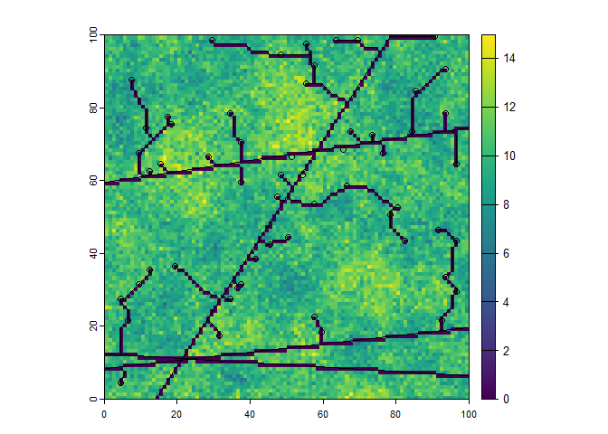

# roads

The roads package offers iterative least cost path and minimum spanning
tree methods for projecting forest road networks. The methods connect a
set of target points to an existing road network using igraph
<https://igraph.org> to identify least cost routes. The cost of
constructing a road segment between adjacent pixels is determined by a
user supplied `weightRaster` and a `weightFunction`; options include the
average of adjacent `weightRaster` values, and a function of the
elevation differences between adjacent cells that penalizes steep
grades. These road network projection methods are intended for
integration into R workflows and modelling frameworks used for
forecasting forest change, and can be applied over multiple timesteps
without rebuilding a graph at each timestep.

## Installation

You can install the released version of roads from
[CRAN](https://CRAN.R-project.org) with:

``` r
install.packages("roads")
```

And the development version from
[GitHub](https://github.com/LandSciTech/roads) with:

``` r
# install.packages("devtools")
devtools::install_github("LandSciTech/roads")
```

## Example

To simulate the development of roads three inputs are needed: the
current road network, the locations that should be connected to the road
network (landings), and a weights raster that together with the
weighting function determines the cost to connect two raster cells with
a road. Typically the roads and landings are `sf` objects or `sp`
Spatial\* objects and the weight is a raster.

``` r
library(roads)
library(raster)

# data set installed with roads package
demoScen <- prepExData(demoScen)
scen <- demoScen[[1]]

prRoads <- projectRoads(landings = scen$landings.points, 
                        weightRaster = scen$cost.rast,
                        roads = scen$road.line, 
                        plotRoads = TRUE) 
```



By default `projectRoads` uses an iterative least cost paths algorithm
(`roadMethod = "ilcp"`) to connect each landing to the existing road by
the lowest cost path, updating the cost after each landing is connected.
A minimum spanning tree method (`roadMethod = "mst"`) is also available.

For more details see
[`vignette("roads-vignette", package = "roads")`](https://landscitech.github.io/roads/articles/roads-vignette.md)

# License

Copyright (C) 2021 Her Majesty the Queen in Right of Canada, as
represented by the Minister of Environment and Climate Change.

And

Copyright 2018 Province of British Columbia

Licensed under the Apache License, Version 2.0 (the “License”); you may
not use this file except in compliance with the License. You may obtain
a copy of the License at

<https://www.apache.org/licenses/LICENSE-2.0>

Unless required by applicable law or agreed to in writing, software
distributed under the License is distributed on an “AS IS” BASIS,
WITHOUT WARRANTIES OR CONDITIONS OF ANY KIND, either express or implied.
See the License for the specific language governing permissions and
limitations under the License.
